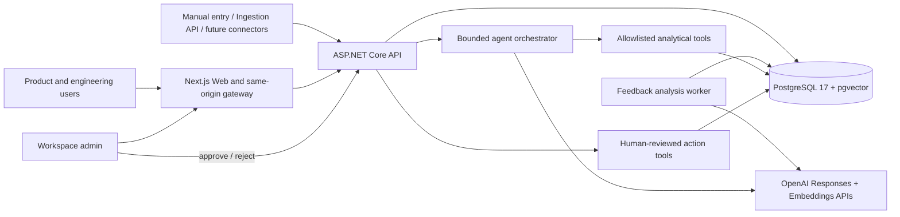
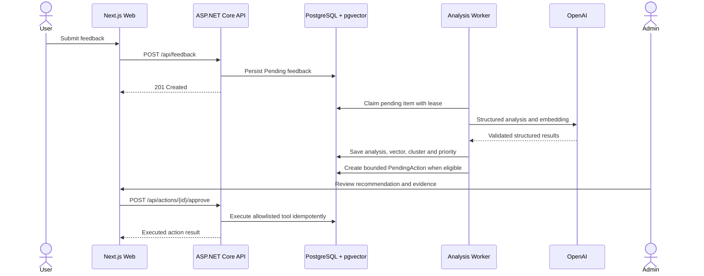

# PulsePilot architecture

PulsePilot turns unstructured product feedback into workspace-scoped analysis,
clusters, priorities, human-reviewed actions, and grounded copilot answers. The
system keeps AI output advisory: deterministic application rules and explicit
admin approval control every write-side action.

## System context

The browser communicates with the Next.js application. Authentication Route
Handlers store the API token in a `Secure`, `HttpOnly`, `SameSite=Lax` cookie,
and the allowlisted same-origin gateway forwards authenticated requests. The API
remains the authorization and workspace-isolation boundary.

## Feedback-to-action sequence

Provider calls run outside database transactions. A feedback item is completed
only after analysis and embedding are validated and persisted atomically. Lease,
retry, stale-recovery, advisory-lock, and unique-index controls make concurrent
processing and repeated approvals safe.

## Clean Architecture boundaries

| Project | Responsibility | Depends on |
| --- | --- | --- |
| `PulsePilot.Domain` | Entities, enums, invariants, priority and review state | Nothing outside the domain |
| `PulsePilot.Application` | Use cases, ports, DTOs, validation, orchestration and tools | Domain |
| `PulsePilot.Infrastructure` | EF Core/PostgreSQL, pgvector, OpenAI adapters, telemetry and hosted processing | Application and Domain |
| `PulsePilot.Api` | HTTP, JWT, authorization, rate limits, Problem Details and health endpoints | Application and Infrastructure |
| `PulsePilot.Worker` | Standalone production-style host for the shared analysis worker | Application and Infrastructure |
| `PulsePilot.Web` | Next.js UI, server-side data loading, HttpOnly session and allowlisted gateway | HTTP API contracts |

## Runtime profiles

| Profile | Topology | Intended use |
| --- | --- | --- |
| Local Compose | Web, API, Worker, one-shot migration and PostgreSQL in separate hardened containers | Development and full-stack acceptance |
| Free Render demo | Free Web, free API with in-process analysis worker, free PostgreSQL | Portfolio demonstration with cold starts |
| Production target | Public Web, private API, standalone Worker, managed PostgreSQL, backups and OTLP backend | Paid deployment after capacity and SLA decisions |

The free Render profile deliberately combines API hosting and background
processing so it does not require a paid Background Worker. This changes the
runtime packaging only; both hosts use the same processing implementation and
the production-style Compose topology remains separate.

## Data and trust boundaries

- Every authenticated operation derives `workspaceId`, `userId`, and role from
  validated JWT claims; request bodies cannot select a workspace.
- PostgreSQL foreign keys, composite keys, query filters, and repository
  predicates reinforce workspace isolation.
- Raw feedback and customer identity fields are excluded from logs, metrics,
  copilot responses, cluster list projections, and report-generation prompts.
- AI output is schema-validated and cannot choose executable tools. Copilot has
  four read-only/analytical tools; write-side tools require an approved action.
- Customer-response output is stored as an unsent draft. PulsePilot does not
  send email or messages.
- Secrets enter through environment variables or Render secret prompts and are
  never Docker build arguments or repository content.
- API errors use bounded RFC Problem Details responses with stable `code` and
  `traceId`; exception messages and stack traces remain server-side.

## Reliability and observability

- `/health/live` reports process liveness; `/health/ready` includes PostgreSQL.
- Structured Serilog events pass through PII redaction before console output.
- OpenTelemetry covers ASP.NET Core, outbound HTTP, PostgreSQL, runtime metrics,
  feedback processing, AI attempts, and action reviews.
- Application retries are bounded and provider SDK retries are disabled to
  prevent multiplicative retry behavior.
- GitHub Actions runs quality gates before container hardening, E2E, dependency
  audit, and Trivy vulnerability checks.

## Related documents

- [API reference](api-reference.md)
- [Cloud deployment](cloud-deployment.md)
- [Container hardening](container-hardening.md)
- [Performance and security baseline](performance-security-baseline.md)
- [Quality baseline](quality-baseline.md)
- [CI pipeline](ci-pipeline.md)
