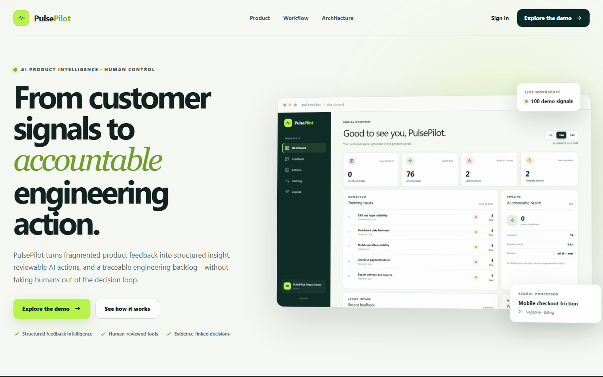
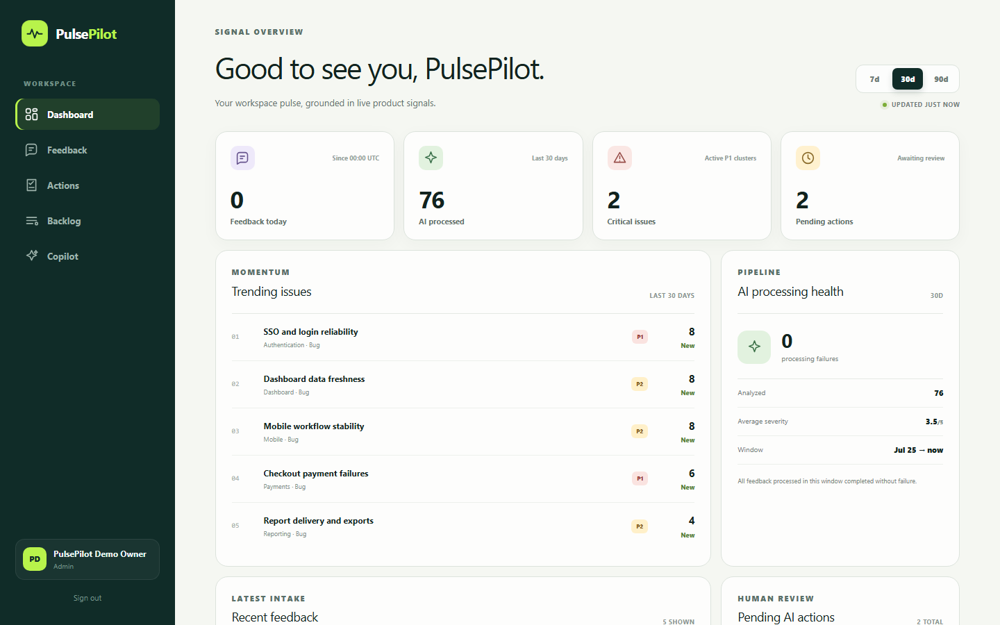
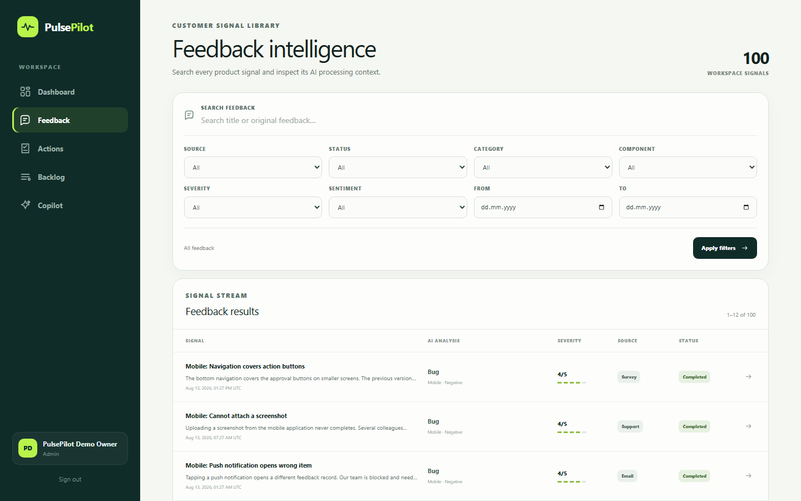
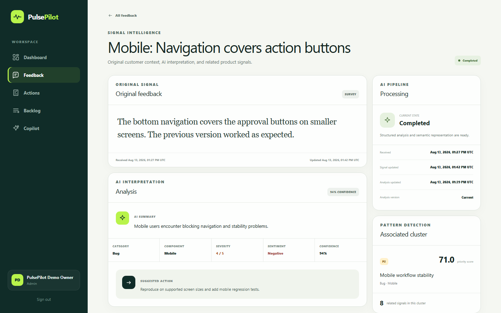
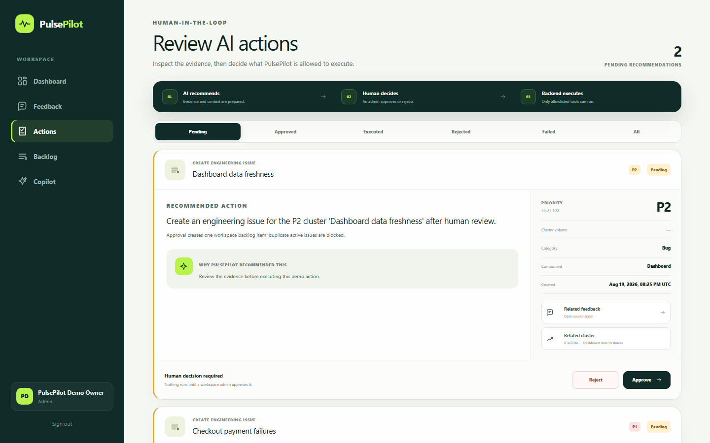
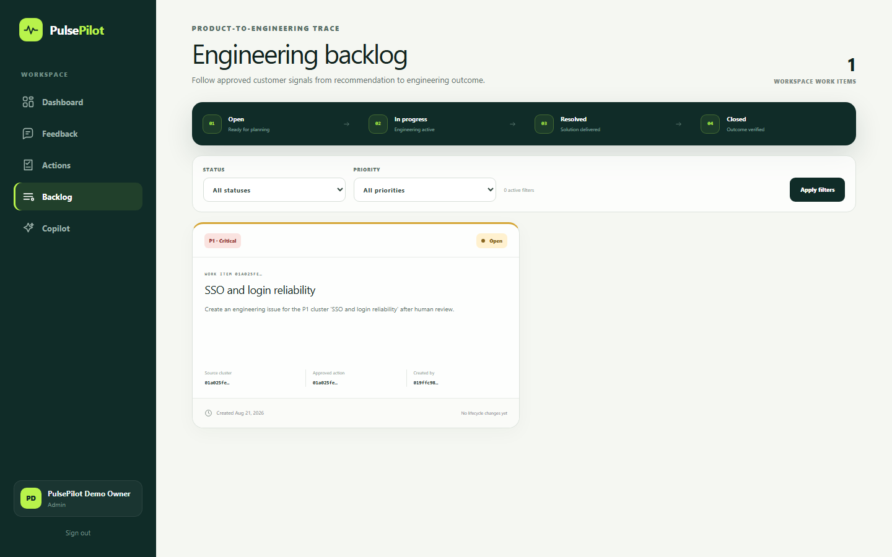
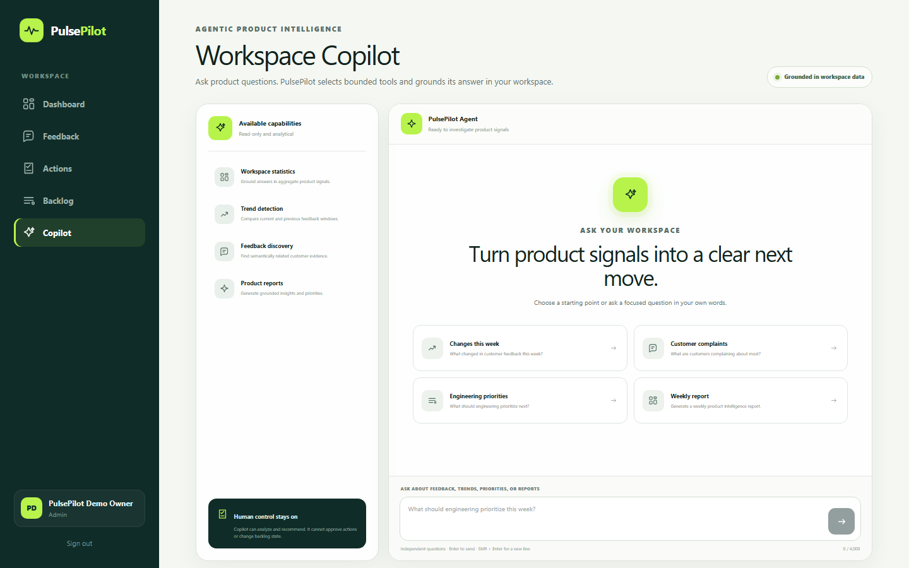

# Portfolio demo guide

Sprint 4 Task 47 provides a repeatable, secret-safe flow for producing the
PulsePilot portfolio screenshots and a short product-tour video from real seeded
data. Generated screenshots are committed below `docs/assets/screenshots`;
the larger WebM recording stays in ignored `artifacts/demo`.

## Demo account

The deterministic seed creates `demo@pulsepilot.ai` as a workspace admin. Its
password is always supplied at deployment or runtime and must never be committed,
placed in a screenshot, or spoken in a recording. For a local capture, enable the
seed in `.env`, choose a unique password of 12-128 characters, and start Compose:

```powershell
docker compose up --build --detach --wait
$env:PULSEPILOT_DEMO_PASSWORD = "<the same local seed password>"
./scripts/capture-demo.ps1
```

For the eventual public Render demo, pass its HTTPS Web origin explicitly and
set the password only in the current shell:

```powershell
$env:PULSEPILOT_DEMO_PASSWORD = "<the Render demo password>"
./scripts/capture-demo.ps1 -BaseUrl https://your-service.onrender.com
```

The capture script does not print the password. Clear the shell variable after
the run and rotate the public demo credential before sharing a recording if the
credential could have appeared on screen.

## Captured tour

The automated tour records these read-only product views without
approving, rejecting, creating, or deleting anything:

1. Public product landing page and its human-control promise.
2. Dashboard KPIs, trend momentum, processing health, and category distribution.
3. Searchable feedback library populated with deterministic synthetic signals.
4. Feedback detail with structured analysis, cluster context, and related reports.
5. Human-in-the-loop recommendation queue and its evidence boundary.
6. Engineering backlog with traceability to approved recommendations.
7. Workspace Copilot capability and safety boundaries.

The stable recording is written to `artifacts/demo/pulsepilot-demo.webm`. Trim or
voice over that file in a video editor; do not commit the exported video to Git.

## Screenshot gallery

### Public product landing page



### Product intelligence dashboard



### Feedback library



### Structured feedback analysis



### Human-in-the-loop action review



### Engineering backlog



### Workspace Copilot



## Suggested 75-second narration

- **0-10s:** Introduce the product promise on the public landing page: “PulsePilot
  turns fragmented SaaS feedback into prioritized product
  intelligence while keeping consequential actions under human control.”
- **10-23s:** Point out volume, trends, processing health, and category mix on the
  dashboard.
- **23-36s:** Open the signal library and one detail page; highlight structured
  analysis, related feedback, and explainable priority.
- **36-50s:** Show the recommendation queue. Explain that the model recommends,
  validation constrains the payload, and a workspace admin decides.
- **50-61s:** Show that approved engineering work remains traceable in the backlog.
- **61-72s:** Show Copilot’s bounded analytical capabilities and grounded tool-use
  contract.
- **72-75s:** Close with “AI proposes. Your team stays accountable.”

## Publishing checklist

- Use synthetic seed data only; inspect every frame for email addresses or keys.
- Keep the browser at 100% zoom and use the automated 1440 x 900 viewport.
- Avoid showing Render/OpenAI dashboards, terminal history, `.env`, or DevTools.
- Blur notifications and unrelated tabs if a separate screen recorder is used.
- Confirm the public demo is awake before recording to avoid cold-start pauses.
- Export a captioned 1080p MP4 for LinkedIn and keep the source WebM locally.
